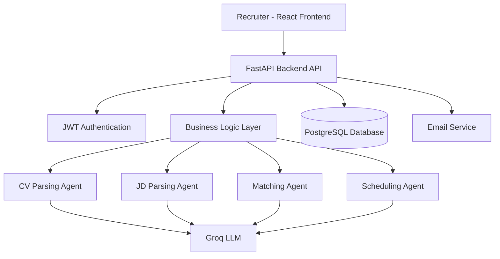

# RecruitIQ --- Intelligent Hiring, Powered by AI

> A production-grade AI recruiting platform that automates resume
> screening, intelligent candidate matching, and interview orchestration
> using modular LLM agents.

------------------------------------------------------------------------


------------------------------------------------------------------------

## 🌐 Live Demo

Production: https://aptivhire.onrender.com\
API Docs: https://aptivhire.onrender.com/docs

------------------------------------------------------------------------

# 📌 Overview

RecruitIQ is a full-stack AI recruiting intelligence system designed to
streamline and automate modern hiring workflows.

It enables recruiters to:

-   Parse resumes into structured candidate profiles\
-   Convert raw job descriptions into structured requirements\
-   Generate AI-based compatibility scores with reasoning\
-   Schedule interviews automatically\
-   Send intelligent email invitations\
-   Manage hiring pipelines securely

Built using FastAPI, PostgreSQL, React, and modular LLM agents.

------------------------------------------------------------------------

# 🏗 Architecture



------------------------------------------------------------------------

# 🚀 Core Features

## Intelligent Resume Parsing

Convert PDF resumes into structured candidate data.

## Job Description Structuring

Transform raw job text into structured skill requirements.

## AI-Based Match Scoring

-   Compatibility score\
-   Skill gap detection\
-   Natural language reasoning

## Interview Automation

-   Prevent duplicate scheduling\
-   Generate AI-powered email invites\
-   Send via SMTP or Gmail API

## Secure Authentication

-   JWT access tokens\
-   Refresh token flow\
-   Protected API endpoints

------------------------------------------------------------------------

# 🧰 Tech Stack

## Backend

-   FastAPI\
-   PostgreSQL\
-   SQLAlchemy\
-   Alembic\
-   JWT Authentication

## AI Layer

-   Groq LLM\
-   Pydantic validation\
-   Modular agent architecture

## Frontend

-   React\
-   Vite\
-   REST API integration

------------------------------------------------------------------------

# 📂 Project Structure

    .
    ├── alembic/
    ├── app/
    │   ├── agents/
    │   ├── routers/
    │   ├── models.py
    │   ├── schemas/
    │   ├── auth.py
    │   ├── db.py
    │   ├── utils/
    │   └── main.py
    ├── frontend/
    ├── Dockerfile
    └── README.md

------------------------------------------------------------------------

# ⚙️ Setup

## Backend

``` bash
uv sync
alembic upgrade head
uvicorn app.main:app --reload
```

## Frontend

``` bash
cd frontend
npm install
npm run dev
```

------------------------------------------------------------------------

# 📊 Performance Metrics

-   Resume parsing latency: \~2 seconds\
-   Match scoring (LLM): \~2--4 seconds\
-   Standard API routes: \<150ms\
-   Indexed DB queries: \<50ms

------------------------------------------------------------------------

# 📸 Screenshots

Add images inside an `assets/` folder:

    assets/dashboard.png
    assets/job-create.png
    assets/candidate-upload.png
    assets/match-score.png
    assets/interview.png

------------------------------------------------------------------------

# 🎥 Demo GIF

Add demo animation:

    assets/recruitiq-demo.gif

------------------------------------------------------------------------

# 📈 Scalability Roadmap

Planned Improvements:

-   Redis caching\
-   Background task queue (Celery / RQ)\
-   Role-based access control\
-   Rate limiting\
-   Horizontal scaling with load balancer\
-   Observability (Prometheus + Grafana)

------------------------------------------------------------------------

# 🛡 Security Design

-   Short-lived access tokens\
-   Refresh token rotation\
-   Protected dependency injection\
-   Environment-based secret management\
-   Production HTTPS recommended

------------------------------------------------------------------------

# 💼 Resume Summary (Elite Version)

Built a production-grade AI recruiting platform using FastAPI,
PostgreSQL, and React that automates resume parsing, LLM-based
candidate-job matching, and interview scheduling with secure JWT
authentication.

Designed a modular multi-agent architecture enabling structured
reasoning, scalable APIs, and deployable cloud-ready infrastructure.

------------------------------------------------------------------------

# 📄 License

Apache License 2.0
